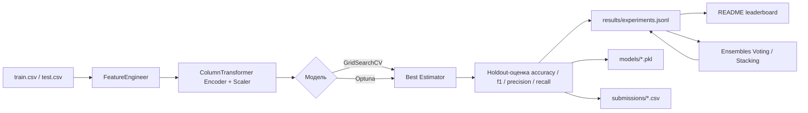

# Titanic Survival Prediction

Конфигурируемый ML-пайплайн для предсказания выживания пассажиров «Титаника»: от feature engineering и предобработки до подбора гиперпараметров, ансамблирования моделей и автоматического обновления лидерборда прямо в этом README.

[](https://www.python.org/)
[](https://hydra.cc/)
[](LICENSE)

---

## 📖 Содержание

- [О проекте](#-о-проекте)
- [Архитектура пайплайна](#-архитектура-пайплайна)
- [Структура репозитория](#-структура-репозитория)
- [Быстрый старт](#-быстрый-старт)
- [Конфигурация (Hydra)](#️-конфигурация-hydra)
- [Feature Engineering](#-feature-engineering)
- [Модели](#-модели)
- [Подбор гиперпараметров](#-подбор-гиперпараметров)
- [Ансамблирование](#-ансамблирование)
- [Логирование экспериментов](#-логирование-экспериментов)
- [Лидерборд](#-лидерборд)
- [Технологии](#️-технологии)
- [Автор](#-автор)

---

## 📌 О проекте

Проект решает классическую задачу [Kaggle Titanic](https://www.kaggle.com/competitions/titanic): предсказать, выжил ли пассажир, на основе демографических и билетных данных.

В отличие от типового решения-ноутбука, проект построен как **воспроизводимый ML-пайплайн**:

- вся конфигурация (данные, модели, препроцессинг, тюнинг, логирование) вынесена в **Hydra YAML-конфиги** — эксперимент можно изменить без правки кода;
- **9 моделей** (от логистической регрессии до нейросети на PyTorch) обучаются и сравниваются в `main.py`;
- гиперпараметры подбираются через **Optuna** (байесовская оптимизация) или **GridSearchCV**;
- лучшие модели автоматически комбинируются в **Voting/Stacking-ансамбли**;
- результаты каждого запуска пишутся в `results/experiments.jsonl`, а таблица лидеров **автоматически подставляется в этот README** между тегами `<!-- leaderboard_start -->` / `<!-- leaderboard_end -->`.

**Ключевые задачи проекта:**

- Разведочный анализ данных (EDA) — `eda.ipynb`
- Feature engineering (титулы, категории тарифа, признаки одиночества/детского возраста)
- Единый конфигурируемый пайплайн предобработки (`ColumnTransformer` + кастомный трансформер)
- Сравнение 7 классических моделей + нейросети на эмбеддингах имён
- Автоматизированный подбор гиперпараметров (Optuna / GridSearch)
- Voting и Stacking ансамбли поверх лучших сохранённых моделей
- Логирование в JSONL + интеграция с Weights & Biases

---

## 🏗 Архитектура пайплайна



Каждая модель в `main.py` проходит один и тот же цикл: `Pipeline(preprocessor → model)` → тюнинг → holdout-оценка → сохранение пайплайна и сабмита → запись эксперимента в лог. Нейросеть (`nn_model.py`) и ансамбли (`ensembles.py`) используют собственные ветки логики, но пишут в тот же лог-файл и тот же формат результата.

---

## 📁 Структура репозитория

```
Titanic/
├── config/                        # Hydra-конфигурация проекта
│   ├── config.yaml                 # Точка входа, собирает все defaults
│   ├── data/titanic.yaml           # Пути к данным и артефактам
│   ├── training/default.yaml       # test/val split, cv_folds, seed
│   ├── preprocessing/
│   │   ├── default.yaml            # drop_columns, q_num, флаги scale/encode
│   │   ├── encoder/                # ohe / ordinal / label / target
│   │   └── scaler/                 # standard / minmax
│   ├── model/                      # По одному файлу на модель (см. ниже)
│   ├── tuning/default.yaml         # Optuna/GridSearch настройки, метрики
│   ├── logging/default.yaml        # console/W&B/сохранение моделей
│   └── solver/mapping.yaml         # penalty↔solver допустимые комбинации LogReg
├── dataset/
│   ├── train.csv
│   ├── test.csv
│   └── gender_submission.csv       # Пример сабмита Kaggle
├── eda.ipynb                       # Разведочный анализ данных
├── preprocessing.py                # FeatureEngineer + сборка preprocessing-пайплайна
├── main.py                         # Точка входа: цикл по всем моделям из конфига
├── tuning_params.py                # GridSearchCV/Optuna обёртки + search space моделей
├── ensembles.py                    # Voting/Stacking поверх лучших сохранённых пайплайнов
├── nn_model.py                     # PyTorch-модель (табличные фичи + эмбеддинг имени)
├── log_reg.py                      # Отдельные утилиты для LogReg (K-Fold, LogisticRegressionCV)
├── log_utils.py                    # JSONL-логирование экспериментов + W&B логгер
├── readme_leaderboard.py           # Сборка лидерборда и автообновление README
├── utils.py                        # Общие хелперы: сиды, сплиты, тайминги, сабмиты
├── requirements.txt
└── README.md
```

> 💡 Директории `models/`, `results/`, `submissions/` создаются автоматически при первом запуске (`ensure_dirs`) и не хранятся в репозитории.

---

## 🚀 Быстрый старт

### Требования

- Python 3.10+
- pip (или conda/venv для изоляции окружения)
- ~2 ГБ свободного места (веса CatBoost/XGBoost/PyTorch)

### Установка

```bash
git clone https://github.com/Danchesy/Titanic.git
cd Titanic

python -m venv .venv
source .venv/bin/activate        # Windows: .venv\Scripts\activate

pip install -r requirements.txt
```

### Запуск полного эксперимента

```bash
python main.py
```

Скрипт последовательно:

1. загружает `dataset/train.csv` / `dataset/test.csv` и делит train на train/val (`train_test_split`, стратификация по `Survived`);
2. для каждой модели из `config/model/` строит пайплайн `preprocessing → model`, подбирает гиперпараметры (Optuna по умолчанию) и оценивает качество на holdout-выборке;
3. обучает нейросеть (`nn_model`) отдельно, с ранней остановкой по `val_loss`;
4. строит Voting- и Stacking-ансамбли поверх топ-`k` лучших сохранённых моделей;
5. сохраняет пайплайны в `models/`, сабмиты в `submissions/`, результаты — в `results/experiments.jsonl`;
6. пересобирает таблицу лидеров и **обновляет её прямо в этом README**.

### Переопределение параметров без правки кода

Проект использует [Hydra](https://hydra.cc/), поэтому любой параметр можно переопределить из командной строки:

```bash
# Отключить тюнинг и просто прогнать модели с параметрами по умолчанию
python main.py tuning.enabled=false

# Использовать GridSearchCV вместо Optuna
python main.py tuning.use_grid_search=true tuning.use_optuna=false

# Увеличить число попыток Optuna и изменить метрику отбора
python main.py tuning.n_trials=100 tuning.metric=f1

# Изменить размер валидационной выборки и число фолдов CV
python main.py training.test_size=0.15 training.cv_folds=10

# Включить логирование в Weights & Biases
python main.py logging.wandb.enabled=true logging.wandb.project=my-titanic
```

### Запуск EDA

```bash
jupyter notebook eda.ipynb
```

Ноутбук содержит анализ распределений (`Pclass`, `Embarked`, `Fare`, `Age`), связи признаков с целевой переменной и обоснование инженерных признаков, использованных в `FeatureEngineer`.

---

## ⚙️ Конфигурация (Hydra)

`config/config.yaml` — точка сборки всех суб-конфигов через механизм `defaults`:

```yaml
defaults:
  - data: titanic
  - training: default
  - preprocessing: default
  - tuning: default
  - logging: default
  - solver: mapping
  - model@model.linear_model: linear_model
  - model@model.knn: knn
  - model@model.dt: dt
  - model@model.rf: rf
  - model@model.xgboost: xgboost
  - model@model.lightgbm: lightgbm
  - model@model.catboost: catboost
  - model@model.nn_model: nn_model
  - model@model.ensemble: ensemble
  - _self_

experiment_name: Titanic
target_column: Survived
seed: 42
```

Каждая модель подключается через `model@model.<name>`, что позволяет держать её гиперпараметры, grid для `GridSearchCV`, флаги предобработки (`is_scale`, `is_cat`) и привязанные encoder/scaler в одном изолированном YAML-файле — добавить новую модель в эксперимент можно без изменения `main.py`.

| Группа | Назначение |
|---|---|
| `data` | Пути к train/test/сабмитам, директории моделей и результатов |
| `training` | `test_size`, `validation_size`, `cv_folds`, `shuffle`, `random_state` |
| `preprocessing` | `drop_columns`, число квантилей `q_num` для `Fare_cat`, дефолтные scaler/encoder |
| `tuning` | Optuna/GridSearch переключатели, `n_trials`, `direction`, метрика отбора, набор метрик для отчёта |
| `logging` | Консольный вывод, сохранение моделей/предсказаний, интеграция с W&B |
| `solver` | Допустимые комбинации `solver`↔`penalty` для `LogisticRegression` (используется в Optuna search space) |

---

## 🧬 Feature Engineering

Вся инженерия признаков инкапсулирована в `FeatureEngineer` (`preprocessing.py`) — это `sklearn`-совместимый трансформер (`fit`/`transform`), который корректно встраивается в `Pipeline` и `cross_val_score`, не допуская утечки данных между фолдами:

| Признак | Как строится |
|---|---|
| `Initial` | Титул, извлечённый регэкспом из `Name` (`Mr`, `Mrs`, `Miss`, `Master`, остальные → `Other`) |
| `Age` | Пропуски заполняются средним возрастом по `Initial`, посчитанным на `fit`-данных |
| `Fare_cat` | Квантильные корзины (`q_num=4` по умолчанию) по стоимости билета, границы фиксируются на `fit` |
| `Male` | Бинарный признак пола |
| `Alone` | `1`, если `SibSp + Parch == 0` |
| `Child` | `1`, если `Age <= 5` |
| `Embarked` | Пропуски заполняются модой порта посадки |

После генерации признаков `PassengerId`, `Name`, `Ticket`, `Cabin`, `Sex`, `Fare` удаляются как избыточные или замененные производными. Дальше в `ColumnTransformer` категориальные колонки (`Embarked`, `Initial`, `Fare_cat`, `Pclass`) кодируются, а числовые (`Age`, `SibSp`, `Parch`) — масштабируются, при этом конкретные encoder/scaler для каждой модели задаются в её собственном конфиге (см. таблицу моделей ниже).

---

## 🤖 Модели

| Модель | Encoder | Scaler | Тюнинг | Особенности |
|---|---|---|---|---|
| `LogisticRegression` | OneHot | Standard | Optuna (solver-aware search space) | Пространство поиска зависит от `solver` через `config/solver/mapping.yaml` |
| `KNeighborsClassifier` | OneHot | Standard | Optuna | Поиск по `n_neighbors`, `weights`, `metric`, `leaf_size` |
| `DecisionTreeClassifier` | Ordinal | — | Optuna | Базовая интерпретируемая модель |
| `RandomForestClassifier` | OneHot | — | Optuna | `n_estimators` до 1000, контроль переобучения через `min_samples_*` |
| `XGBClassifier` | Ordinal | Standard | Optuna | Регуляризация `reg_alpha`/`reg_lambda`, `subsample`, `colsample_bytree` |
| `LGBMClassifier` | Ordinal | — | Optuna | Нативная поддержка категориальных признаков |
| `CatBoostClassifier` | — (нативные `cat_features`) | — | Optuna | `cat_features` передаются через `fit_params`, а не `__init__`, чтобы не ломать `sklearn.clone` при CV |
| `NN_Model` (PyTorch) | Ordinal | MinMax | Ранняя остановка (без Optuna) | Табличные фичи + `nn.Embedding` для токенизированного имени пассажира (см. ниже) |
| `Ensemble` | — | — | — | Voting и Stacking поверх top-k лучших сохранённых моделей |

### Нейросеть (`TitanicNet`)

Двухветочная архитектура на PyTorch:

1. **Табличная ветка** — предобработанные числовые/категориальные признаки подаются напрямую в MLP.
2. **Текстовая ветка** — имя пассажира токенизируется собственным `Tokenizer` (word-level, `max_seq_len=10`, `<PAD>`/`<UNK>`), пропускается через `nn.Embedding(embedding_dim=16)` и разворачивается в плоский вектор.

Обе ветки конкатенируются и подаются в `Linear(32) → ReLU → Dropout → BatchNorm1d → Linear(1) → Sigmoid`. Обучение — `BCELoss` + `Adam` + `ReduceLROnPlateau`, с ранней остановкой по `val_loss` (`patience=15`, `min_delta=1e-5`). Лучший чекпоинт (веса, оптимизатор, планировщик, словарь токенизатора) сохраняется в `models/*.pt`.

---

## 🎯 Подбор гиперпараметров

Поддерживаются два независимых режима (переключаются флагами `tuning.use_optuna` / `tuning.use_grid_search`):

- **Optuna** (по умолчанию) — байесовская оптимизация с `n_trials` испытаниями внутри `cross_val_score` (`cv_folds`-фолдовая стратифицированная CV). Пространства поиска заданы в `tuning_params.py` индивидуально для каждой модели (`*_optuna_params`). Для `LogisticRegression` пространство динамически зависит от выбранного `solver` — недопустимые комбинации `solver`/`penalty` исключаются через `config/solver/mapping.yaml`.
- **GridSearchCV** — исчерпывающий перебор сетки `grid_params`, заданной в конфиге каждой модели (`config/model/*.yaml`).

Обе ветки в `tuning_params.py` возвращают единый формат результата: лучший пайплайн, метрики на holdout-выборке (`accuracy`, `f1_score`, `precision`, `recall`), время тюнинга и latency предсказания на объект — всё это пишется в лог эксперимента.

---

## 🧩 Ансамблирование

`ensembles.py` строит ансамбли **не заново обучая базовые модели**, а переиспользуя уже сохранённые лучшие пайплайны из `results/experiments.jsonl` (по одному лучшему пайплайну на тип модели, топ-`k` по `accuracy`, `k` задаётся в `config/model/ensemble.yaml`):

- **`PreTrainedVotingClassifier`** — усредняет `predict_proba` базовых моделей (soft voting).
- **`PreTrainedStackingClassifier`** — обучает мета-модель (`LogisticRegression`) поверх вероятностей базовых моделей.

Оба класса реализуют `fit`/`predict`/`score`/`get_params`, что позволяет им проходить через ту же логику логирования и сохранения, что и остальные модели в пайплайне.

---

## 📝 Логирование экспериментов

Каждый запуск (обучение модели, тюнинг, ансамбль) добавляет одну строку в `results/experiments.jsonl` (`add_result` / `add_nn_res`) со стандартизированным набором полей: `model`, `accuracy`, `f1_score`, `precision`, `recall`, `std`, `params`, `tuning_time_sec`, `predict_time_sec`, `latency_ms_per_sample`, `path` (путь к сохранённому пайплайну).

Опционально включается зеркалирование метрик и артефактов модели в **Weights & Biases** (`WandbLogger` в `log_utils.py`):

```bash
python main.py logging.wandb.enabled=true logging.wandb.project=titanic logging.wandb.entity=<ваш-wandb-entity>
```

---

## 📊 Лидерборд

Таблица ниже собирается автоматически функцией `update_readme_leaderboard` (`readme_leaderboard.py`) в конце каждого запуска `main.py` — для каждой модели берётся её лучший по `accuracy` эксперимент из `results/experiments.jsonl`. **Не редактируйте её вручную** — при следующем запуске правки будут перезаписаны.

<!-- leaderboard_start -->
| model                        |   accuracy |   f1_score |   tuning_time_sec |   latency_ms_per_sample |
|:-----------------------------|-----------:|-----------:|------------------:|------------------------:|
| LogisticRegression           |   0.832402 |   0.765625 |          13.9     |                0.1217   |
| LGBMClassifier               |   0.826816 |   0.739496 |          19.46    |                0.0873   |
| KNeighborsClassifier         |   0.821229 |   0.741935 |          13.46    |                0.1256   |
| PreTrainedStackingClassifier |   0.821229 |   0.737705 |           0.11    |                0.279325 |
| XGBClassifier                |   0.815642 |   0.717949 |          32.44    |                0.0873   |
| PreTrainedVotingClassifier   |   0.810056 |   0.711864 |           0       |                0.28491  |
| RandomForestClassifier       |   0.810056 |   0.716667 |         181.45    |                0.2103   |
| NN_Model                     |   0.810056 |   0.730159 |           3.40888 |                0.162009 |
| CatBoostClassifier           |   0.793296 |   0.699187 |         998.27    |                0.1286   |
| DecisionTreeClassifier       |   0.782123 |   0.666667 |           7.66    |                0.0817   |
<!-- leaderboard_end -->

**Ключевые наблюдения:**

- `LogisticRegression` с корректно подобранным `solver`/`penalty` через Optuna оказалась сильнейшей одиночной моделью — на табличных данных такого масштаба (~900 строк) простая линейная модель конкурентоспособна с бустингами.
- Градиентный бустинг (`LightGBM`, `XGBoost`) и стекинг-ансамбль показывают близкие результаты в диапазоне 0.81–0.82.
- `CatBoost` с нативной обработкой категорий уступает моделям с явным энкодингом — вероятно, требует более тщательного тюнинга `depth`/`iterations` под размер выборки.
- Нейросеть с эмбеддингом имени (`NN_Model`) заметно отстаёт от классических моделей — на выборке такого размера табличные бустинги и линейные модели остаются более эффективными, чем deep learning.
- `DecisionTreeClassifier` — самая слабая модель, ожидаемо: одиночное дерево без ансамблирования сильно переобучается или недообучается на этом наборе признаков.

---

## 🛠️ Технологии

| Категория | Инструменты |
|---|---|
| Обработка данных | `pandas`, `numpy` |
| Классический ML | `scikit-learn` |
| Градиентный бустинг | `xgboost`, `lightgbm`, `catboost` |
| Глубокое обучение | `torch`, `torchmetrics` |
| Подбор гиперпараметров | `optuna` |
| Конфигурация | `hydra-core`, `omegaconf` |
| Визуализация | `matplotlib`, `seaborn`, `shap` |
| Эксперимент-трекинг | `wandb` (опционально) |
| Прочее | `joblib` (сериализация пайплайнов), `tabulate` (markdown-таблицы) |

Полный список версий — в [`requirements.txt`](requirements.txt).

## 👤 Автор

**Danchesy** — [GitHub](https://github.com/Danchesy)

## 📄 Лицензия

Проект распространяется под лицензией MIT. Подробности — в файле [LICENSE](LICENSE).
